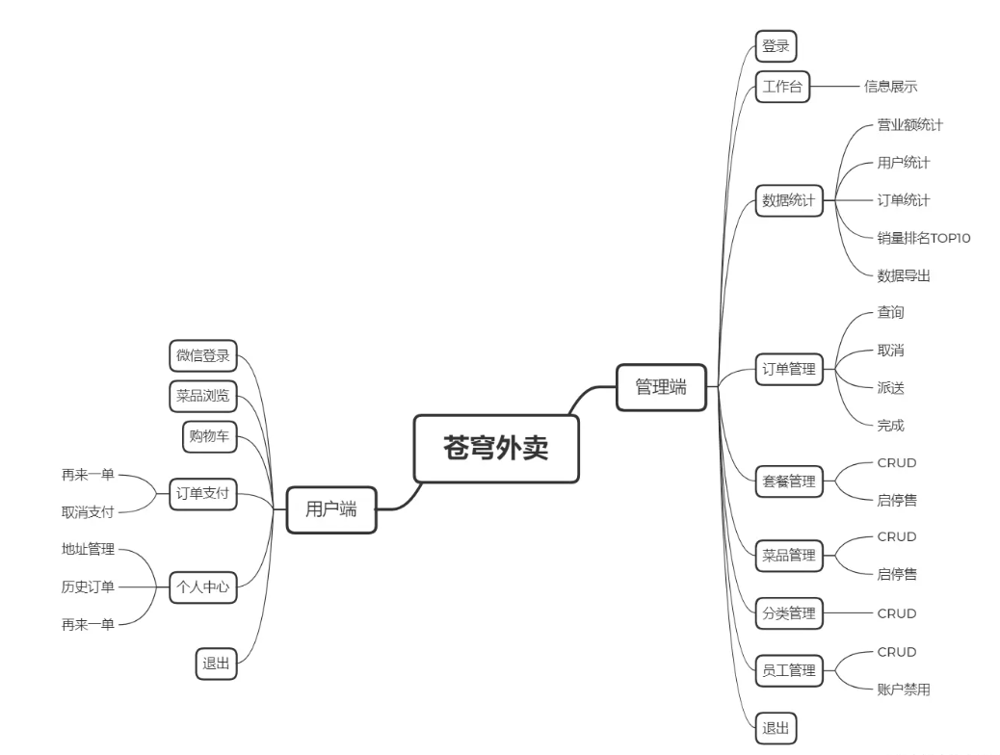
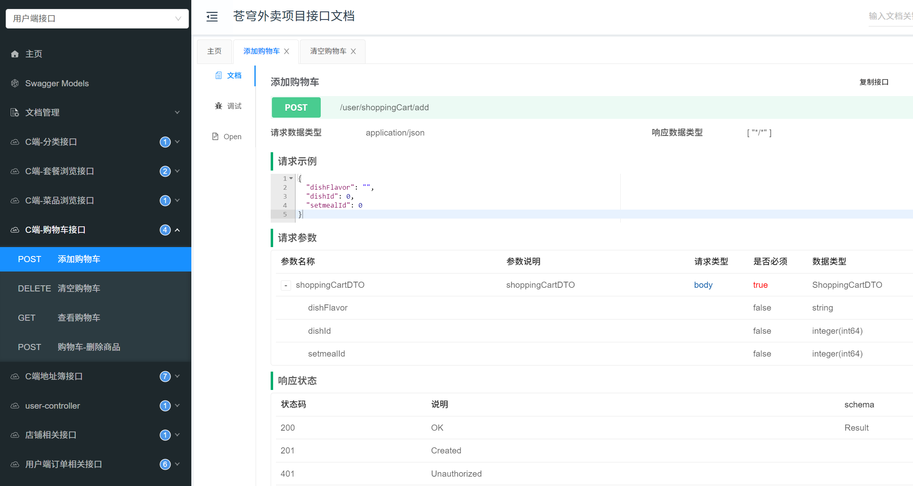

# FoodDelivery

苍穹外卖是一个基于现代Web技术构建的外卖配送系统，旨在优化外卖配送过程，提高配送效率，并为用户提供便捷的订单管理与配送跟踪功能。本项目采用了**Spring Boot**框架，结合**MySQL**数据库，通过RESTful API与统一返回类进行通信，支持JWT认证，确保接口安全性。

## 业务功能



## 技术栈

- **Web框架**：Spring Boot（用于开发RESTful API和提供HTTP服务）
- **ORM框架**：MyBatis（用于与MySQL数据库进行CRUD操作）
- **数据库**：MySQL（用于存储用户信息、订单数据、商家信息等）
- **安全框架**：JWT（用于身份认证，确保请求的合法性）
- **API文档**：Swagger（自动生成API文档，便于接口测试）
- **缓存**：Redis（用于优化查询速度）

## 业务逻辑与设计

### 1. RESTful API 与 统一返回类

- 项目使用RESTful API设计，所有请求都遵循标准的HTTP方法：GET（查询）、POST（创建）、PUT（更新）、DELETE（删除）。
- 统一返回类封装了所有接口返回的格式，确保所有接口的返回格式一致。返回的JSON结构示例如下：

```
json复制代码{
  "code": 200,
  "message": "success",
  "data": {...}
}
```

### 2. ORM与数据库交互

- 使用**MyBatis**框架与**MySQL**数据库进行CRUD操作。
- 实现了**分页查询**和**模糊查询**功能，确保在大数据量时依然能够提供快速的响应。
- 使用**多对多关系**：例如，用户和订单之间是多对多关系，商家和菜品之间也是多对多关系。

### 3. 多对多实体关联关系

- **用户与订单**：一个用户可以拥有多个订单，一个订单可以由多个用户（如团体订单）组成。
- **商家与菜品**：一个商家可以提供多种菜品，而每个菜品可以在多个商家之间出售。

### 4. 安全性设计

- 使用**JWT**进行用户身份认证。
- 用户登录时生成JWT令牌，后续请求必须带上该令牌进行验证，确保请求合法。
- JWT令牌包含用户信息和权限数据，用于验证和授权。

### 5. 架构规范

- **三层架构**：项目遵循经典的三层架构模式（控制器层、业务层、数据层）。
- **命名规范**：使用Java驼峰命名规范，类名、方法名、变量名均遵循统一命名规则。
- **代码注释**：每个功能模块和重要方法都进行了详细注释，确保代码易于理解和维护。

#### 目录结构

```
src
├── controller          # 控制层，负责与前端交互
├── service             # 业务层，包含核心业务逻辑
├── repository          # 数据层，负责与数据库交互
├── entity              # 实体类，映射数据库表
├── config              # 配置文件，包含Swagger、JWT等配置
└── utils               # 工具类
```

## API文档

项目使用Swagger生成接口文档，所有接口都遵循RESTful风格设计，支持GET、POST、PUT、DELETE等操作。

通过访问以下路径，你可以查看并测试所有的API接口：

- Swagger UI  http://localhost:8080/doc.html
- 

## 安装与运行

1. 克隆本仓库：

	git clone https://github.com/J-jxr/FoodDelivery.git

2. 运行项目：

	```
	mvn spring-boot:run
	```

## 贡献

欢迎任何人提交issues或pull requests，大家一起为项目做出贡献！

